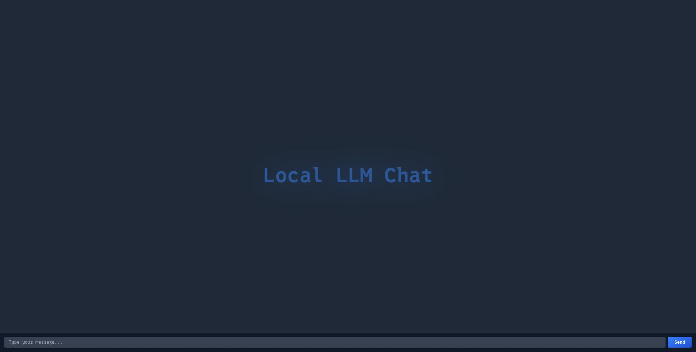
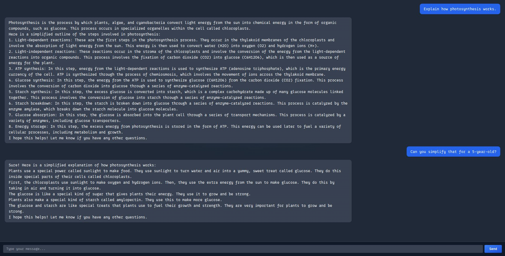

<!-- :toc: macro -->
<!-- :toc-title: -->
<!-- :toclevels: 99 -->

# LLMux <!-- omit from toc -->

> A lightweight local LLM chat with a web UI and a C‑based server that runs any LLM chat executable as a child and communicates via pipes.

## Table of Contents <!-- omit from toc -->

* [General Information](#general-information)
* [Technologies Used](#technologies-used)
* [Features](#features)
* [Screenshots](#screenshots)
* [Setup](#setup)
* [Usage](#usage)
* [Project Status](#project-status)
* [Room for Improvement](#room-for-improvement)
* [Acknowledgements](#acknowledgements)
* [Contact](#contact)
* [License](#license)

## General Information

LLMux makes running a local LLM chat easier by providing Tailwind‑powered web UI + a minimal C server that simply spawns any compatible chat executable and talks to it over UNIX pipes. Everything runs on your machine — no third‑party services — so you retain full privacy and control. LLMux is good for:

* Privacy‑conscious users who want a self‑hosted, browser‑based chat interface.
* Developers who need to prototype a chat front‑end around a custom model without writing HTTP or JavaScript plumbing from scratch.

## Technologies Used

* **llama.cpp** — tag `b5391`
* **CivetWeb** — commit `85d361d85dd3992bf5aaa04a392bc58ce655ad9d`
* **Tailwind CSS** — `v3.4.16`
* **C++ 17** for the example chat executable
* **GNU Make / Bash** for build orchestration

## Features

* Browser‑based chat UI served by a tiny C HTTP server
* Pluggable LLM chat executable — just point at any compatible binary
* Configurable model name, context length, server port and max response length via `#define` in `server.c` and `llm.cpp`
* Build script ( `build.sh` ) to compile everything into `out/` and run `clang-format` on sources

## Screenshots




## Setup

1. **Obtain a model** compatible with `llama.cpp` ( e.g. a `.gguf` file ) and place it in the `models/` directory.
1. **( Optional )** If you don't use the example C++ chat app ( `llm_chat` aka `llm.cpp` ), update its `LLM_CHAT_EXECUTABLE_NAME` to match your chosen binary.
1. Get [_llama.cpp_](https://github.com/ggml-org/llama.cpp/releases/latest) and [_CivetWeb_](https://github.com/civetweb/civetweb/blob/master/docs/Installing.md).
1. Run:
    ```bash
    ./build.sh
    ```
This will:
1. Compile the C server and C++ example chat app
1. Place all outputs under `out/`
1. Format the source files with `clang-format`

## Usage

1. In `out/`, set the `LLM_CHAT_EXECUTABLE_NAME` macro in `server.c` to your chat binary name and re‑build if needed.
1. Start the server:
    ```bash
    ./out/server
    ```
1. Note the printed port number ( e.g. `Server started on port 8080` ).
1. Open your browser at `http://localhost:<port>` to start chatting.

## Project Status

Project is complete.All planned functionality — spawning the LLM, piping I/O, rendering a chat UI — is implemented.

## Room for Improvement

To do:

* **Dynamic response buffer:** Switch from fixed buffers to dynamic allocation in `server.c`.
* **Prompt unescape:** Properly unescape JSON‑style sequences ( `\"`, `\\\`, etc. ) in incoming prompts before forwarding.

## Acknowledgements

* Inspired by the [_simple‑chat example in llama.cpp_](https://github.com/ggml-org/llama.cpp/blob/master/examples/simple-chat/simple-chat.cpp)

## Contact

Created by [@lurkydismal](https://github.com/lurkydismal) - feel free to contact me!

## License

This project is open source and available under the
[GNU Affero General Public License v3.0](https://github.com/lurkydismal/LLMux/blob/main/LICENSE).
